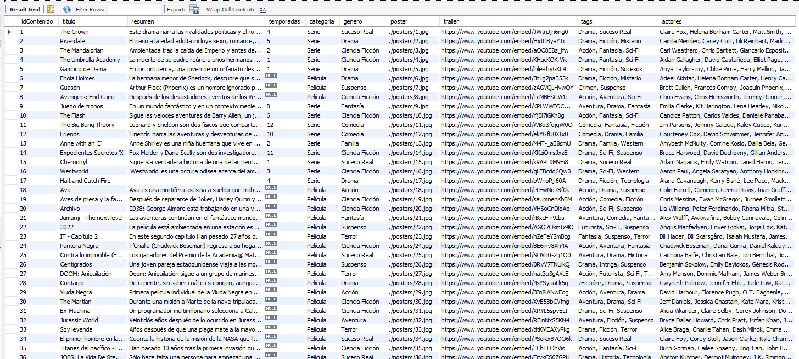

# 🎬 TP3 Final Backend - 📄 DOCUMENTACION 📄

##  💪🏼 Desafío de Base de Datos: Trailerflix

##  👩🏼‍🤝‍👩 Integrantes 👩🏼‍🤝‍👩: 
- 🎐 Beverly J.L. Gonzalez
- 🎐 Romina Iurchik
- 🎐 Mariana Jobse

# 📁 Parte 1: Modelo Relacional

## Migrar trailerFlix(NoSQL) hacia un modelo relacional(SQL)

Observando el archivo trailerflix.json (con papel y lápiz en mano): 
- 1. Identificar las propiedades
- 2. Definir atributos
- 3. Establecer relaciones
- 4. Normalizar los datos
- 5. Diseñar el esquema, en nuestro caso utilizamos: DB Designer (https://dbdesigner.page.link/8d4K7rnqkLx5UngQ6)
- 6. Exportar el esquema creado con: "export as sql script"

## En VSC

Definicion de un script para la migracion de los datos json a SQL. En este caso se utilizó OpenIA. 

Se creo el archivo `generateInsertSQL.js` y lo ejecuta el archivo `script.js` quien lee el archivo `trailerflix.json` para convertir el json.

## En MySQLWorkbrench: 
Crear el Schema a utilizar --> `trailerflix`

Seleccionar el Schema creado --> ` use trailerflix;`

Ejecutar el script de creacion de tablas y relaciones exportado desde DB Designer --> `Creo_Trailerflix.sql`

Ejecutar el script de insercion de datos `insert_contenido.sql`

Para ver si los datos se exportaron bien se crea la consulta: `veo_todoelcontenido.sql`

# 


# 🧮 Parte 2: Consultas SQL


🔗 Endpoints

| Método | Ruta                  | Descripción                                |
| ------ | --------------------- | -------------------------------------------|
| GET    | /catalogo             | Lista el catálogo completo de Trailerflix  |
| GET    | /categoria/:categoria | Lista el catálogo por categoría            |             
| GET    | /titulo/:titulo       | Busca dentro del catálogo por título       |          

---

## 💡 Ejemplos de uso

### 🔍 GET `/catalogo`

**Request:**

```
GET http://localhost:3010/catalogo
```

**Parámetros**: No requiere.

**Respuesta:**

- `200 OK`: Lista Catalogo de Trailerflix.
- `500 Internal Server Error`: Error al conectarse a la base de datos.

```json
[
  {
    "idCatalogo": 1,
    "titulo": "The Crown",
    "resumen": "Este drama narra las rivalidades políticas y el romance de la reina Isabel II, así como los sucesos que moldearon la segunda mitad del siglo XX.",
    "duracion": null,
    "temporadas": 4,
    "busqueda": null,
    "Categorium": {
      "categoriaName": "Serie"
    },
    "Genero": {
      "generoName": "Suceso Real"
    },
    "Tags": [
      {
        "tagName": "Drama"
      },
      {
        "tagName": "Suceso Real"
      }
    ],
    "Actors": [
      {
        "actorName": "Claire Fox"
      },
      {
        "actorName": "Olivia Colman"
      },
      {
        "actorName": "Matt Smith"
      },
      {
        "actorName": "Tobias Menzies"
      },
      {
        "actorName": "Vanesa Kirby"
      },
      {
        "actorName": "Helena Bonham Carter"
      }
    ],
    "Poster": {
      "posterName": "./posters/1.jpg"
    },
    "Trailer": {
      "trailerName": "https://www.youtube.com/embed/JWtnJjn6ng0"
    }
  },
  {
    "idCatalogo": 2,
    "titulo": "Riverdale",
    "resumen": "El paso a la edad adulta incluye sexo, romance, escuela y familia. Para Archie y sus amigos, también hay misterios oscuros.",
    "duracion": null,
    "temporadas": 5,
    "busqueda": null,
    "Categorium": {
      "categoriaName": "Serie"
    },
    "Genero": {
      "generoName": "Drama"
    },
    "Tags": [
      {
        "tagName": "Drama"
      },
      {
        "tagName": "Ficción"
      },
      {
        "tagName": "Misterio"
      }
    ],
    "Actors": [
      {
        "actorName": "Lili Reinhart"
      },
      {
        "actorName": "Casey Cott"
      },
      {
        "actorName": "Camila Mendes"
      },
      {
        "actorName": "Marisol Nichols"
      },
      {
        "actorName": "Madelaine Petsch"
      },
      {
        "actorName": "Mädchen Amick"
      }
    ],
    "Poster": {
      "posterName": "./posters/2.jpg"
    },
    "Trailer": {
      "trailerName": "https://www.youtube.com/embed/HxtLlByaYTc"
    }
  },
  ...
]
```

---
